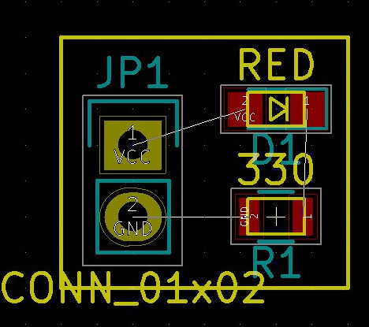

# HPCB
Create a PCB programmatically instead of using a GUI
(like OpenSCAD for 3d modelling)

# Hello world !
~~~~~
$ sudo apt install haskell-platform
$ mkdir hello-world
$ cd hello-world
$ cabal sandbox init
$ cabal install hpcb
~~~~~

Edit led.hs and copy/paste the following code :

~~~~~
module Main (
  main
) where

import Hpcb
import Data.Monoid

outline :: Circuit
outline =
  rectangle w h
  # translate (V2 (w/2-2.54) (h/2-2.54*1.5))
  # layer EdgeCuts
  where (w, h) = (4*2.54, 3.5*2.54)

ledBoard :: Circuit
ledBoard = (
  pinHeaderFromNets "JP1" ["VCC", "GND"]
  <> led_805 "D1" "RED" # rotate 180 # translate (V2 (2.54*2) (-1.27))
  <> r805 "R1" "330" # rotate 180 # translate (V2 (2.54*2) 2.54)
  <> outline
  )
  # connect (net "VCC") (pinName "D1" "A")
  # connect (pinName "D1" "K") (pin "R1" 1)
  # connect (net "GND") (pin "R1" 2)

main :: IO ()
main = runCircuit ledBoard
~~~~~

Then produce the board file like this :

~~~~~
ghc --make led.hs
./led > led.kicad_pcb
~~~~~

Then open led.kicad_pcb with Kicad.

# What does it do ?
- Places components, translates, rotates them (and composes translations and rotations)
- Makes electrical connections (ratsnest, but not routing)
- Outputs a Kicad PCB file

# What doesn't it do (yet) ?
- Routing
- Flipping components (putting them on the back side of a board)

# How to
## Connect components
4 functions are available to make connections :
connect, net, pin, and pinName.

Here are some examples :

### Example 1
Create a resistor named "R1", of value "10k" and connect its pin number 1 to net "GND".

~~~~~
resistor = r805 "R1" "10k" # connect (net "GND") (pin "R1" 1)
~~~~~

### Example 2
Create an LED named "D1", of value "RED", and connect its cathode named "K" to net "GND"

~~~~~
led = led_805 "D1" "RED" # connect (net "GND") (pinName "D1" "K")
~~~~~

### Example 3
Create an Atemage328p named "U1", and connect all its VCC pins to net "VCC", and all its GND pins to net "GND".

~~~~~
mcu =
  atmega328p_au "U1"
  # connect (net "VCC") (pinName "VCC")
  # connect (net "VCC") (pinName "AVCC")
  # connect (net "GND") (pinName "U1" "GND")
~~~~~

# Example 4
Create 2 leds, an connect their 2 anodes together.

~~~~~
leds =
  ( led_805 "D1" "RED"
  <> led_805 "D2" "GREEN"
  )
  # connect (pinName "D1" "A") (pinName "D2" "A")

~~~~~

### Pitfalls

# For contributors

## Coordinate system
## How to make a new footprint
